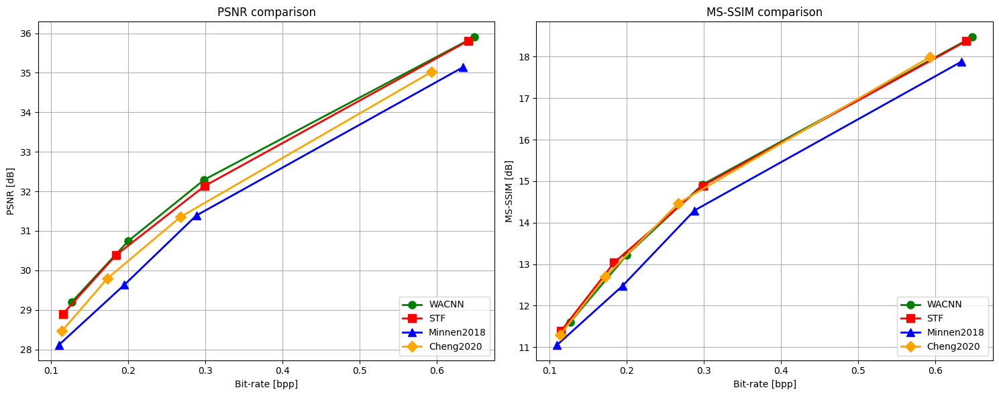
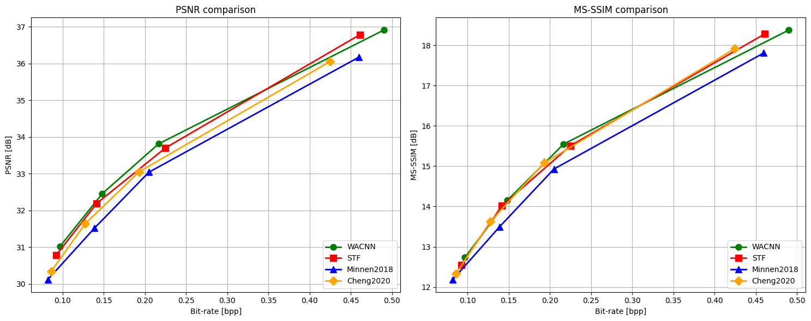

# Modify
## Steps
### 1. Create a New Conda Environment
```bash
conda create -n compressai python=3.8
conda activate compressai
```

### 2. Update `pip`
```bash
conda install pip
pip install --upgrade pip
```

### 3. Clone the CompressAI Repository
```bash
git clone https://github.com/brianlu97010/CompressAI compressai
```

### 4. Install CompressAI
Navigate to the repository folder and install the package.
```bash
cd compressai
pip install -e .
pip install -e '.[all]' # install all optional dependencies
```

## Pre-Trained Models
Download the pre-trained models for STF and WACNN into the [ckpt](./ckpt/) directory. Ensure the paths are correctly set to load these models during execution.
Pretrained models (optimized for MSE) trained from scratch using randomly chose 300k images from the OpenImages dataset.

Lambda 越大 -> 越在乎 PSNR

| Method | Lambda | Link                                                                                              |
| ---- |--------|---------------------------------------------------------------------------------------------------|
| CNN | 0.0018 | [cnn_0018](https://drive.google.com/file/d/1RPdtyxTtfosuDe1-xtl5JzvnCU2vYnHD/view?usp=sharing)    |
| CNN | 0.0035 | [cnn_0035](https://drive.google.com/file/d/1L7xvei3Wj4BeSQ3lDBL-pyjEy13RKsjn/view?usp=sharing)    |
| CNN | 0.0067 | [cnn_0067](https://drive.google.com/file/d/1DDCFFWBUa5cYOgJ9D9HPcwoOigzoJK31/view?usp=sharing)    |
| CNN | 0.025  | [cnn_025](https://drive.google.com/file/d/1LrAWPlBE6WJUfjiDPGFO8ANSaP5BFEQI/view?usp=sharing)     |
| STF | 0.0018 | [stf_0018](https://drive.google.com/file/d/15ujpSjif628iwVEay3mAWN-Vyqls3r23/view?usp=sharing) |
| STF | 0.0035 | [stf_0035](https://drive.google.com/file/d/1OFzZoEaofNgsimBuOPHtgOJiGsR_RS-M/view?usp=sharing)    |
| STF | 0.0067 | [stf_0067](https://drive.google.com/file/d/1SjhqcKyP3SqVm4yhJQslJ6HgY1E8FcBL/view?usp=share_link) |
| STF | 0.013  | [stf_013](https://drive.google.com/file/d/1mupv4vcs8wpNdXCPclXghliikJyYjgj-/view?usp=share_link)  |
| STF | 0.025  | [stf_025](https://drive.google.com/file/d/1rsYgEYuqSYBIA4rfvAjXtVSrjXOzkJlB/view?usp=sharing)     |
| STF | 0.0483 | [stf_0483](https://drive.google.com/file/d/1cH5cR-0VdsQqCchyN3DO62Sx0WGjv1h8/view?usp=share_link) |

Other pretrained models will be released successively.
### Citation
```
@inproceedings{zou2022the,
  title={The Devil Is in the Details: Window-based Attention for Image Compression},
  author={Zou, Renjie and Song, Chunfeng and Zhang, Zhaoxiang},
  booktitle={CVPR},
  year={2022}
}
```

## Running the Demo
Navigate to the [comparison.ipynb](.examples/comparison.ipynb) to open the demo notebook.
```bash 
examples/comparison.ipynb
```

This notebook demonstrates the comparison of various CompressAI baseline models and the STF, WACNN model.

## Results Reproduction
### Kodak dataset with 24 images



| Model | Lambda | PSNR [dB] | MS-SSIM | Bpp    |
|-------|--------|-----------|---------|--------|
| WACNN | 0018   | 29.205    | 0.931   | 0.127  |
| STF   | 0018   | 28.895    | 0.927   | 0.115  |
| WACNN | 0035   | 30.745    | 0.952   | 0.200  |
| STF   | 0035   | 30.387    | 0.950   | 0.184  |
| WACNN | 0067   | 32.293    | 0.968   | 0.298  |
| STF   | 0067   | 32.136    | 0.968   | 0.299  |
| WACNN | 025    | 35.903    | 0.986   | 0.648  |
| STF   | 025    | 35.808    | 0.985   | 0.641  |

---

### CLIC Professional vailidation dataset with 41 high resolution images



| Model | Lambda | PSNR [dB] | MS-SSIM | Bpp    |
|-------|--------|-----------|---------|--------|
| WACNN | 0018   | 31.014    | 0.947   | 0.097  |
| STF   | 0018   | 30.785    | 0.944   | 0.092  |
| WACNN | 0035   | 32.452    | 0.962   | 0.148  |
| STF   | 0035   | 32.191    | 0.960   | 0.142  |
| WACNN | 0067   | 33.810    | 0.972   | 0.217  |
| STF   | 0067   | 33.700    | 0.972   | 0.225  |
| WACNN | 025    | 36.907    | 0.985   | 0.490  |
| STF   | 025    | 36.782    | 0.985   | 0.461  |


----

<!--  -->
<a href="url"></a>

[](https://github.com/InterDigitalInc/CompressAI/blob/master/LICENSE)
[](https://pypi.org/project/compressai/)
[](https://pypi.org/project/compressai/#files)

CompressAI (_compress-ay_) is a PyTorch library and evaluation platform for
end-to-end compression research.

CompressAI currently provides:

* custom operations, layers and models for deep learning based data compression
* a partial port of the official [TensorFlow compression](https://github.com/tensorflow/compression) library
* pre-trained end-to-end compression models for learned image compression
* evaluation scripts to compare learned models against classical image/video
  compression codecs


> **Note**: Multi-GPU support is now experimental.

## Installation

CompressAI supports python 3.8+ and PyTorch 1.7+.

**pip**:

```bash
pip install compressai
```

> **Note**: wheels are available for Linux and MacOS.

**From source**:

A C++17 compiler, a recent version of pip (19.0+), and common python packages
are also required (see `setup.py` for the full list).

To get started locally and install the development version of CompressAI, run
the following commands in a [virtual environment](https://docs.python.org/3.6/library/venv.html):

```bash
git clone https://github.com/InterDigitalInc/CompressAI compressai
cd compressai
pip install -U pip && pip install -e .
```

For a custom installation, you can also run one of the following commands:
* `pip install -e '.[dev]'`: install the packages required for development (testing, linting, docs)
* `pip install -e '.[tutorials]'`: install the packages required for the tutorials (notebooks)
* `pip install -e '.[all]'`: install all the optional packages

> **Note**: Docker images will be released in the future. Conda environments are not
officially supported.

## Documentation

* [Installation](https://interdigitalinc.github.io/CompressAI/installation.html)
* [CompressAI API](https://interdigitalinc.github.io/CompressAI/)
* [Training your own model](https://interdigitalinc.github.io/CompressAI/tutorials/tutorial_train.html)
* [List of available models (model zoo)](https://interdigitalinc.github.io/CompressAI/zoo.html)

## Usage

### Examples

Script and notebook examples can be found in the `examples/` directory.

To encode/decode images with the provided pre-trained models, run the
`codec.py` example:

```bash
python3 examples/codec.py --help
```

An examplary training script with a rate-distortion loss is provided in
`examples/train.py`. You can replace the model used in the training script
with your own model implemented within CompressAI, and then run the script for a
simple training pipeline:

```bash
python3 examples/train.py -d /path/to/my/image/dataset/ --epochs 300 -lr 1e-4 --batch-size 16 --cuda --save
```
> **Note:** the training example uses a custom [ImageFolder](https://interdigitalinc.github.io/CompressAI/datasets.html#imagefolder) structure.

A jupyter notebook illustrating the usage of a pre-trained model for learned image
compression is also provided in the `examples` directory:

```bash
pip install -U ipython jupyter ipywidgets matplotlib
jupyter notebook examples/
```

### Evaluation

To evaluate a trained model on your own dataset, CompressAI provides an
evaluation script:

```bash
python3 -m compressai.utils.eval_model checkpoint /path/to/images/folder/ -a $ARCH -p $MODEL_CHECKPOINT...
```

To evaluate provided pre-trained models:

```bash
python3 -m compressai.utils.eval_model pretrained /path/to/images/folder/ -a $ARCH -q $QUALITY_LEVELS...
```

To plot results from bench/eval_model simulations (requires matplotlib by default):

```bash
python3 -m compressai.utils.plot --help
```

To evaluate traditional codecs:

```bash
python3 -m compressai.utils.bench --help
python3 -m compressai.utils.bench bpg --help
python3 -m compressai.utils.bench vtm --help
```

For video, similar tests can be run, CompressAI only includes ssf2020 for now:

```bash
python3 -m compressai.utils.video.eval_model checkpoint /path/to/video/folder/ -a ssf2020 -p $MODEL_CHECKPOINT...
python3 -m compressai.utils.video.eval_model pretrained /path/to/video/folder/ -a ssf2020 -q $QUALITY_LEVELS...
python3 -m compressai.utils.video.bench x265 --help
python3 -m compressai.utils.video.bench VTM --help
python3 -m compressai.utils.video.plot --help
```

## Tests

Run tests with `pytest`:

```bash
pytest -sx --cov=compressai --cov-append --cov-report term-missing tests
```

Slow tests can be skipped with the `-m "not slow"` option.


## License

CompressAI is licensed under the BSD 3-Clause Clear License

## Contributing

We welcome feedback and contributions. Please open a GitHub issue to report
bugs, request enhancements or if you have any questions.

Before contributing, please read the CONTRIBUTING.md file.

## Authors

* Jean Bégaint, Fabien Racapé, Simon Feltman and Hyomin Choi, InterDigital AI Lab.

## Citation

If you use this project, please cite the relevant original publications for the
models and datasets, and cite this project as:

```
@article{begaint2020compressai,
	title={CompressAI: a PyTorch library and evaluation platform for end-to-end compression research},
	author={B{\'e}gaint, Jean and Racap{\'e}, Fabien and Feltman, Simon and Pushparaja, Akshay},
	year={2020},
	journal={arXiv preprint arXiv:2011.03029},
}
```

For any work related to the variable bitrate models, please cite
```
@article{kamisli2024dcc_vbrlic,
	title={Variable-Rate Learned Image Compression with Multi-Objective Optimization and Quantization-Reconstruction Offsets},
	author={Kamisli, Fatih and Racap{\'e}, Fabien and Choi, Hyomin},
	year={2024},
	booktitle={2024 Data Compression Conference (DCC)},
	eprint={2402.18930},
}
```

## Related links
 * Tensorflow compression library by _Ballé et al._: https://github.com/tensorflow/compression
 * Range Asymmetric Numeral System code from _Fabian 'ryg' Giesen_: https://github.com/rygorous/ryg_rans
 * BPG image format by _Fabrice Bellard_: https://bellard.org/bpg
 * HEVC HM reference software: https://hevc.hhi.fraunhofer.de
 * VVC VTM reference software: https://vcgit.hhi.fraunhofer.de/jvet/VVCSoftware_VTM
 * AOM AV1 reference software: https://aomedia.googlesource.com/aom
 * Z. Cheng et al. 2020: https://github.com/ZhengxueCheng/Learned-Image-Compression-with-GMM-and-Attention
 * Kodak image dataset: http://r0k.us/graphics/kodak/

